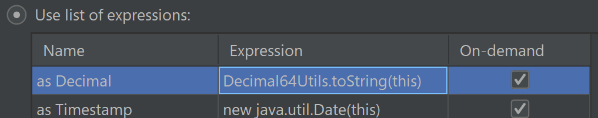
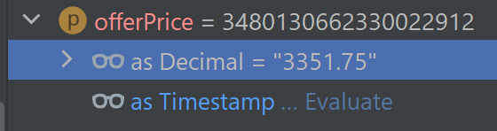

### Tips and Tricks

# How to view decimal-encoded values in IntelliJ/IDEA debugger

IntelliJ/IDEA can define custom renderers for most types, including `long` used to represent decimal numbers.

Use the following steps to add special renderer for decimals:

1. Open Settings and search for "renderer". Pick "Java Type renderers" from the settings list.

2. Switch "When expanding a node" radio button into "Use list of renderers". Define renderer for decimal. Use `Decimal64Utils.toString(this)` as renderer expression:

3. When viewing `long` value that contains decimal number expand your Decimal renderer:

